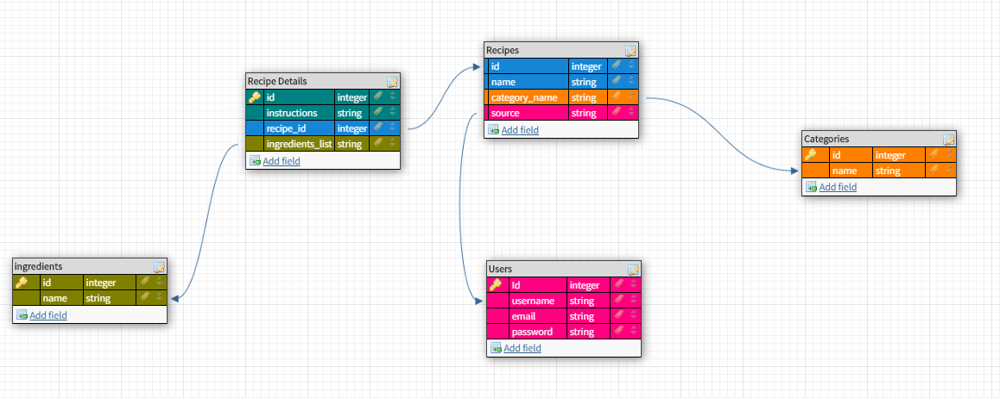

## api

# Welcome to Secret Family Recipes! A CRUD-operations-based api.
This project is built to help families create, post, and edit their secret recipes that have been passed down for generations.

## Table Diagram

-  Users can register - /api/auth/register
-  Users can log in - /api/auth/login
-  Users can view & add their recipes - /api/recipes
-  Users can edit and delete their own recipes - api/recipes/:id

-  This app includes automated testing for each route using jest, supertest, and
   cross-env packages
-  This app also includes custom middleware for authenticating users, sending
   authentication tokens back and forth w/the client, and ensuring data
   integrity for POSTs, PUTs, and DELETEs
